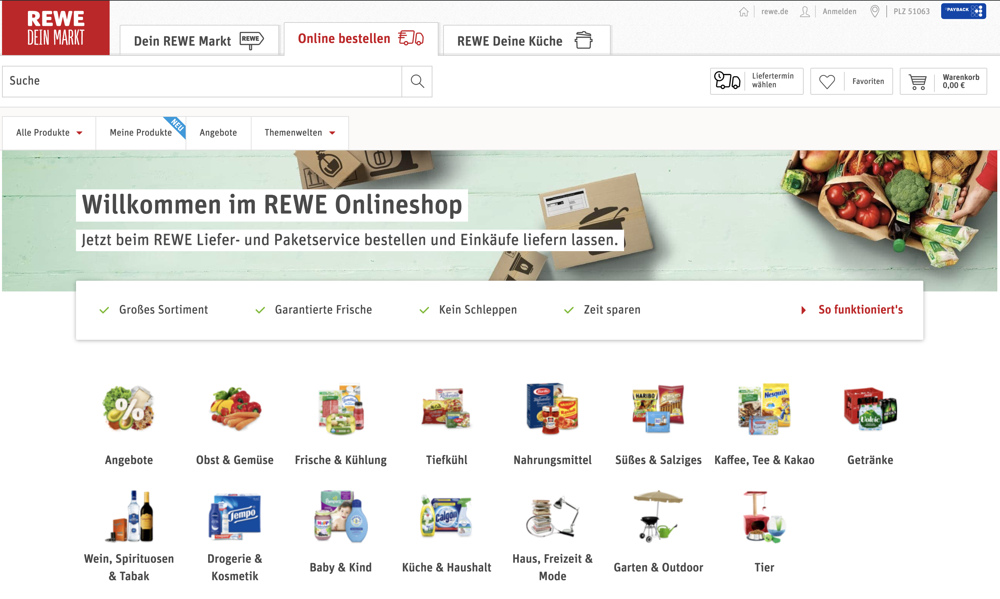
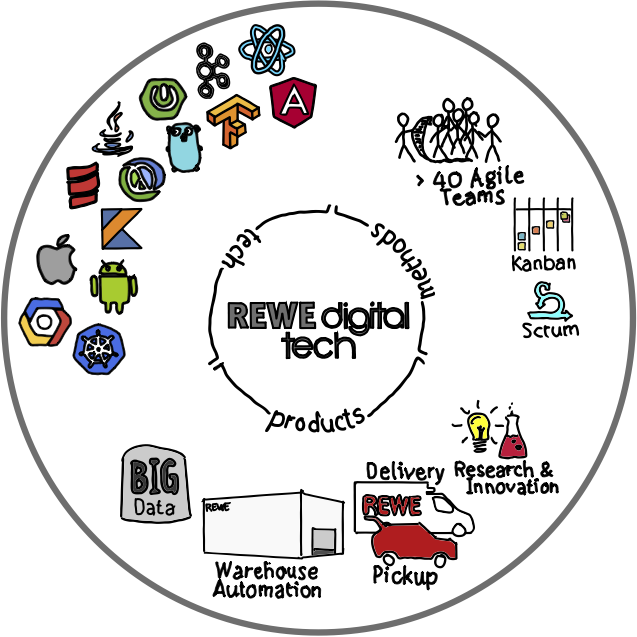
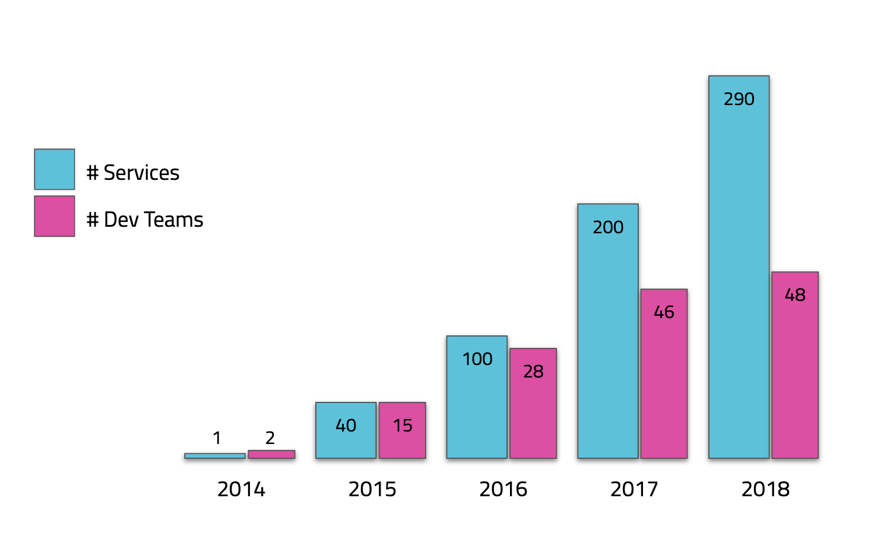

theme: Simple, 1
background-color: #FFFFFF
text: #777777, alignment(left), line-height(1), text-scale(1.0), Titillium Web
header: #25c5dc, alignment(left), line-height(1), text-scale(1.0), Titillium Web
link: #25c5dc, alignment(left), line-height(1), text-scale(1.0), Titillium Web
autoscale: true


[.header: #000000, alignment(center), line-height(1), text-scale(1.0), Titillium Web]


# Frühling schreibt man mit K
## Spring Boot mit Kotlin
### Stefan Scheidt, REWE digital

---

# Über mich

* Software Engineer bei REWE digital in Köln
* Passionierter Software Crafter
* > 20 Jahre Software-Entwicklung im Unternehmensumfeld
* Aktuell: Microservices mit Spring Boot und Java/Kotlin
* [Twitter](https://twitter.com/stefanscheidt)/[GitHub](https://github.com/stefanscheidt): `stefanscheidt`

---

# Agenda

* Spring Framework
* Spring Boot
* Kotin
* Kotlin vs. Java
* Spring Boot & Kotlin
* Erfahrungen

---

# Spring Framework

> "The Spring Framework provides a comprehensive programming and configuration model for modern Java-based enterprise applications - on any kind of deployment platform."
-- [spring.io](https://spring.io/projects/spring-framework)

---

# Spring Framework

* "An inversion of control container and an application framework for the Java Platform"[^1]
* > 15 years old
* Many [modules](https://docs.spring.io/spring/docs/5.1.7.RELEASE/spring-framework-reference/) and [side projects](https://spring.io/projects)

[^1]: [Wikipedia](https://en.wikipedia.org/wiki/Spring_Framework)

---

# Spring Boot

> "Spring Boot makes it easy to create stand-alone, production-grade Spring based Applications that you can 'just run'."
-- [spring.io](https://spring.io/projects/spring-boot)

---

# Spring Boot - Features

* Create stand-alone Spring applications
* Embed Tomcat, Jetty or Undertow directly
* Provide opinionated 'starter' dependencies to simplify build configuration
* Automatically configure Spring and 3rd party libraries whenever possible
* Provide production-ready features such as metrics, health checks and externalized configuration

---

# Kotlin

* Programming Language for JVM, Android, Browser, Native
* Concise, Safe, Interoperable, Tool-friendly
* Developed by [JetBrains](https://www.jetbrains.com/), Open Source since 2012, v 1.0 in Feb. 2016
* 2017: Google announced first class support for Kotlin on Android
* 2019: Kotlin is the preferred language for Android development

---

# Kotlin by Example

* [Hello, World!](https://play.kotlinlang.org/byExample/01_introduction/01_Hello%20world)
* [Variables](https://play.kotlinlang.org/byExample/01_introduction/03_Variables)
* [Null Safety](https://play.kotlinlang.org/byExample/01_introduction/04_Null%20Safety)
* [Classes](https://play.kotlinlang.org/byExample/01_introduction/05_Classes), [Data Classes](https://play.kotlinlang.org/byExample/03_special_classes/01_Data%20classes)
* [Functions](https://play.kotlinlang.org/byExample/01_introduction/02_Functions), [Extention Functions](https://play.kotlinlang.org/byExample/04_functional/03_extensionFunctions)

---

# Kotlin - Extention Functions

> "Kotlin provides the ability to extend a class with new functionality without having to inherit from the class or use any type of design pattern such as Decorator."
-- [Kotlin Reference](https://kotlinlang.org/docs/reference/extensions.html)

---

# Kotlin - Extention Functions

Instead of this

```kotlin
fun <T> swap(list: MutableList<T>, index1: Int, index2: Int) {
    // implementation omitted ...
}

val list = mutableListOf(1, 2, 3)

swap(list, 1, 2)
```

---

# Kotlin - Extention functions

... we can write this

```kotlin
fun <T> MutableList<T>.swap(index1: Int, index2: Int) {
    // same implementation as before ...
}

val list = mutableListOf(1, 2, 3)

list.swap(1,2)
```

---

# Kotlin - Reified Type Parameters

* Functions marked with `inline` will be inlined by the compiler
* In generic inlined functions, type parameters can be marked with `reified` and passed in at call side

---

# Kotlin - Reified Type Parameters

```kotlin
inline fun <reified T> TreeNode.findParentOfType(): T? {
    var p = parent
    while (p != null && p !is T) { // no reflection!
        p = p.parent
    }
    return p as T?
}

// usage:
treeNode.findParentOfType<MyTreeNode>()
```

---

# Spring Boot with Kotlin

* [Official Support](https://docs.spring.io/spring-framework/docs/current/spring-framework-reference/languages.html#kotlin) since Spring Boot 2
* Initial Project Setup via [Spring Initializr](https://start.spring.io/)

---

# Dedicated Support for Kotlin in Spring (Boot)

* [Null Safety](https://docs.spring.io/spring-framework/docs/current/spring-framework-reference/languages.html#kotlin-null-safety)
* [Extention Functions](https://docs.spring.io/spring-framework/docs/current/spring-framework-reference/languages.html#kotlin-extensions)
* [Bean Definition DSL](https://docs.spring.io/spring-framework/docs/current/spring-framework-reference/languages.html#kotlin-bean-definition-dsl)
* [Web Router DSL](https://docs.spring.io/spring-framework/docs/current/spring-framework-reference/languages.html#router-dsl)
* [Mock Web MVC DSL](https://docs.spring.io/spring-framework/docs/current/spring-framework-reference/languages.html#router-dsl)
* [Coroutines](https://docs.spring.io/spring-framework/docs/current/spring-framework-reference/languages.html#coroutines)

---

# [Demo](https://start.spring.io/)

---

# Incubator - KoFu

> "designed to configure Spring Boot explicitly with code in a declarative way with great discoverability thanks to auto-complete"
-- [Spring Fu](https://github.com/spring-projects-experimental/spring-fu)

---

# REWE digital



---

# REWE digital



---

# REWE digital



---

# Kotlin @ REWE digital

*   Android
    *   REWE Angebote & Lieferservice (seit 2016!)
    *   PENNY Coupons & Angebote
    *   5+ Apps in Fulfillment

*   Spring Boot
    *   10+ Microservices (eCom, Fulfillment)

---

# Resources - Kotlin

* [kotlinlang.org](https://kotlinlang.org/docs/reference/)
* [Kotlin Koans](https://kotlinlang.org/docs/tutorials/koans.html)
* [Learn Kotlin by Example](https://play.kotlinlang.org/byExample/overview)
* [Kotlin for Java Developers @ Coursera](https://www.coursera.org/learn/kotlin-for-java-developers)

---

# Resources - Spring Boot with Kotlin

* [Spring Framework Reference](https://docs.spring.io/spring-framework/docs/current/spring-framework-reference/languages.html#kotlin) since Spring Boot 2
* [spring.io Tutorial](https://spring.io/guides/tutorials/spring-boot-kotlin/)
* [Spring I/O 2018 Conference Talk (YouTube)](https://www.youtube.com/watch?v=btNIey_2Zdw)
* [Devnexus 2019 Conference Talk (YouTube) Part I](https://www.recallact.com/presentation/kotlin-jumpstart-venkat-and-josh-part-1) & [Part II](https://www.recallact.com/presentation/kotlin-jumpstart-venkat-and-josh-part-2)
* [Spring I/O 2019 Keynote (YouTube)](https://youtu.be/Ylrxpbs6vcs?list=PLe6FX2SlkJdTlXfwer8JB-WGm-TEyIB2k&t=2763)
* [Spring I/O 2019 Conference Talk (YouTube)](https://www.youtube.com/watch?v=kL_xTXXjEeE)
* [Spring Fu](https://github.com/spring-projects-experimental/spring-fu)

---

[.header: #000000, alignment(center), line-height(1), text-scale(1.0), Titillium Web]


# Thank you!

### Contact: `stefanscheidt` on [Twitter](https://twitter.com/stefanscheidt) and [GitHub](https://github.com/stefanscheidt)
