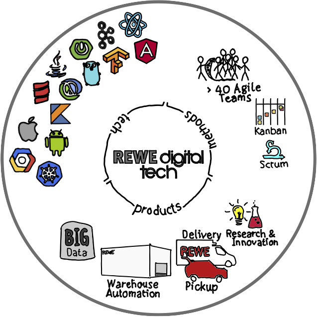

theme: simple
background-color: #4c585a
text: #d9d9d9, alignment(left), line-height(1), text-scale(1.0), Arial
header: #d9d9d9, alignment(left), line-height(1), text-scale(1.0), Arial
link: #61c1dd, alignment(left), line-height(1), text-scale(1.0), Arial
autoscale: true

# Spring Boot & Kotlin

## Stefan Scheidt, REWE digital

---

[.build-lists: true]

# About me

* Software engineer at REWE digital in Cologne/Germany
* Current building microservices with Spring Boot and Java/Kotlin
* [Twitter](https://twitter.com/stefanscheidt)/[GitHub](https://github.com/stefanscheidt): `stefanscheidt`

---

[.build-lists: true]

# Agenda

* Spring Boot & Kotlin Demo
* Spring Framework & Spring Boot
* Spring Boot & Kotlin @ REWE digital
* Resources

---

# Spring Boot & Kotlin [Demo](https://start.spring.io/)

---

# Spring Framework & Spring Boot

---

# Spring Framework

> "The Spring Framework provides a comprehensive programming and configuration model for modern Java-based enterprise applications."
-- [spring.io](https://spring.io/projects/spring-framework)

---

# Spring Framework

* "An inversion of control container and an application framework for the Java Platform"[^1]
* 17+ years old
* Many [modules](https://docs.spring.io/spring-framework/docs/current/spring-framework-reference/) and [side projects](https://spring.io/projects)

[^1]: [Wikipedia](https://en.wikipedia.org/wiki/Spring_Framework)

---

# Support for Kotlin in Spring Framework

[.build-lists: true]

* [Null Safety](https://docs.spring.io/spring-framework/docs/current/spring-framework-reference/languages.html#kotlin-null-safety)
* [Extention Functions](https://docs.spring.io/spring-framework/docs/current/spring-framework-reference/languages.html#kotlin-extensions)
* DSLs
    * [Web Router DSL](https://docs.spring.io/spring-framework/docs/current/spring-framework-reference/languages.html#router-dsl)
    * [Mock Web MVC DSL](https://docs.spring.io/spring-framework/docs/current/spring-framework-reference/languages.html#router-dsl)
    * ...
* [Coroutines](https://docs.spring.io/spring-framework/docs/current/spring-framework-reference/languages.html#coroutines)
    * see also [Going Reactive with Spring, Coroutines and Kotlin Flow](https://spring.io/blog/2019/04/12/going-reactive-with-spring-coroutines-and-kotlin-flow)

---

# Spring Boot

> "Spring Boot makes it easy to create stand-alone, production-grade Spring based Applications that you can 'just run'."
-- [spring.io](https://spring.io/projects/spring-boot)

---

# Spring Boot Features

[.build-lists: true]

* Create stand-alone Spring applications
* Embed Tomcat, Jetty or Undertow directly
* Provide opinionated 'starter' dependencies to simplify build configuration
* Automatically configure Spring and 3rd party libraries whenever possible
* Provide production-ready features such as metrics, health checks and externalized configuration

---

# Support for Kotlin in Spring Boot

[.build-lists: true]

* [Official Support](https://docs.spring.io/spring-boot/docs/current/reference/html/spring-boot-features.html#boot-features-kotlin) since Spring Boot 2.x
    * [dependency managment](https://docs.spring.io/spring-boot/docs/current/reference/html/features.html#features.kotlin.dependency-management)
    * [extention functions](https://docs.spring.io/spring-boot/docs/current/reference/html/features.html#features.kotlin.api)
    * [immutable configuration properties](https://docs.spring.io/spring-boot/docs/current/reference/html/features.html#features.kotlin.configuration-properties)
* Initial Project Setup via [Spring Initializr](https://start.spring.io/)
* See also ["The State of Kotlin Support in Spring" Talks by Sébastien Deleuze on YouTube](https://www.youtube.com/results?search_query=The+State+of+Kotlin+Support+in+Spring)

---

# Reactive Spring & Kotlin Coroutines

* [Going Reactive with Spring, Coroutines and Kotlin Flow](https://spring.io/blog/2019/04/12/going-reactive-with-spring-coroutines-and-kotlin-flow)
* [Deepdive into Reactive Spring with Coroutines and Kotlin Flow by Sébastien Deleuze](https://youtu.be/BoidEr_ZCGc)

---

# Spring Fu

> "Incubator for Java and Kotlin Configuration DSL designed to configure Spring Boot explicitly with code in a declarative way."
-- [Spring Fu](https://github.com/spring-projects-experimental/spring-fu)

---

[.background-color: #2c383a]

```kotlin
val app = webApplication {
	beans {
		bean<SampleService>()
	}
	webMvc {
		port = if (profiles.contains("test")) 8181 else 8080
		router {
			val service = ref<SampleService>()
			GET("/") {
				ok().body(service.generateMessage())
			}
			GET("/api") {
				ok().body(Sample(service.generateMessage()))
			}
		}
		converters {
			string()
			jackson
}   }   }

fun main() { app.run() }
```

---

# Spring Boot & Kotlin<br>@ REWE digital

---

# REWE digital



---

# Kotlin @ REWE digital

*   Android
    *   REWE Angebote & Lieferservice (since 2016!)
    *   PENNY Coupons & Angebote
    *   Many Apps in Fulfillment
    *   ...
*   Spring Boot & Kotlin
    *   Many Microservices

---

[.build-lists: true]

# How we started using Kotlin with Spring Boot

1.   REWE Angebote & Lieferservice app, 2016 with Kotlin
1.   A few teams built a few new µ-services with SB and Kotlin
1.   Teams in FF built Android apps and SB Backends in Kotlin
1.   Internal [coding dojos](https://rewe-digital.com/en/inside-stories/show/code-katas-and-coding-dojos.html) did the [Kotlin Koans](https://kotlinlang.org/docs/koans.html)
1.   Kotlin was often used in regular coding dojos @ REWE digital
1.   Some devs took [Kotlin for Java Developers](https://de.coursera.org/learn/kotlin-for-java-developers) @ Coursera
1.   FF built a shared Kafka consumer library in Kotlin

---

# Resources

---

# Resources - Kotlin

* [kotlinlang.org](https://kotlinlang.org/docs/reference/)
* [Learn Kotlin by Example](https://play.kotlinlang.org/byExample/overview)
* [Kotlin Koans](https://kotlinlang.org/docs/koans.html)
* [Kotlin for Java Developers](https://www.coursera.org/learn/kotlin-for-java-developers) (Coursera)

---

# Resources - Spring Boot with Kotlin

* [Spring Framework Reference](https://docs.spring.io/spring-framework/docs/current/spring-framework-reference/languages.html#kotlin)
* [Spring Boot Reference](https://docs.spring.io/spring-boot/docs/current/reference/htmlsingle/#features.kotlin)
* [spring.io Tutorial](https://spring.io/guides/tutorials/spring-boot-kotlin/)
* [The State of Kotlin Support in Spring](https://youtu.be/j2OEtSO2gvM) (YouTube)

---

# Slides


### <https://speakerdeck.com/stefanscheidt/spring-boot-with-kotlin>

---

# Sources


### <https://github.com/stefanscheidt/spring-boot-kotlin>

---

# Thank you!

### Contact: `stefanscheidt` on [Twitter](https://twitter.com/stefanscheidt) and [GitHub](https://github.com/stefanscheidt)

---

# Appendix

---

# Kotlin - Extention Functions

Instead of this

```kotlin
fun <T> swap(list: MutableList<T>, index1: Int, index2: Int) {
    // implementation omitted ...
}

val list = mutableListOf(1, 2, 3)

swap(list, 1, 2)
```

---

# Kotlin - Extention functions

... we can write this

```kotlin
fun <T> MutableList<T>.swap(index1: Int, index2: Int) {
    // now the list is bound to 'this'
}

val list = mutableListOf(1, 2, 3)

list.swap(1,2)
```

---

# Kotlin - Reified Type Parameters

* Functions marked with `inline` will be inlined by the compiler
* In inlined generic functions, type parameters can be marked with `reified` and passed in at call side

---

# Kotlin - Reified Type Parameters

```kotlin
inline fun <reified T> TreeNode.findFirstAncestorOfTypeOrNull(): T? {
    var p = this.parent
    while (p != null && p !is T) { // no reflection!
        p = p.parent
    }
    return p as T?
}

// usage:
treeNode.findParentOfType<MyTreeNode>()
```
